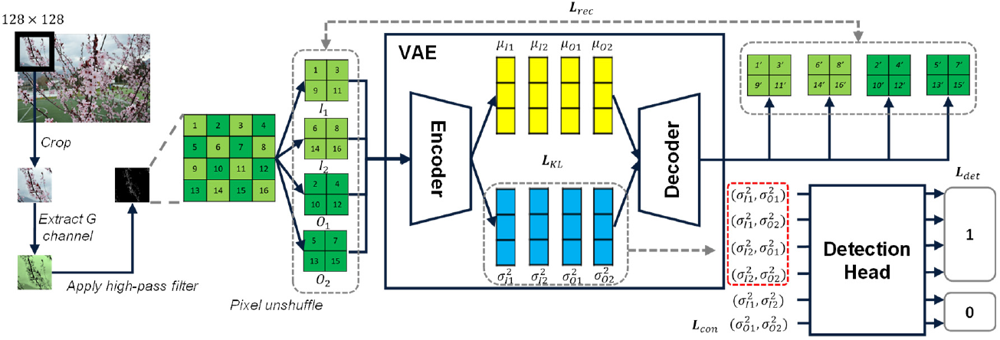

# Real Images Hold the Key to Detecting AI-generated Images Using Bayer Pattern Analysis

This is the repository for paper [Real Images Hold the Key to Detecting AI-generated Images Using Bayer Pattern Analysis]() accepted to ICIPW 2025.

## Checkpoints

Our trained models can be found [here](https://www.dropbox.com/scl/fi/7ipcrikl0yve3niwyu039/ours_github.pth?rlkey=omogg9sdwx0yy73nh1s9yhmfn&st=kep3el84&dl=0).